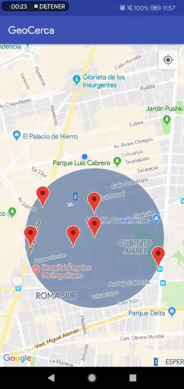

# Geocercas-public
> Ejercio de una aplicación android usando Geocercas de google.

- Verifica la entrada emitiendo un sonido y lanzando una notificación.
 


- Verifica la salida emitiendo un sonido y lanzando una notificación.


## Dependencias
1. Primero se generaron las credenciales correspondientes con la restricción de certificado y se copio la clave API

2. Se agregaron los permisos

```
<uses-permission android:name="android.permission.ACCESS_FINE_LOCATION"/>

```


## Contacto

Coral Rodríguez – [@coral](https://www.linkedin.com/in/dulcoral/) – dulcoral20@gmail.com

[git](https://github.com/dulcoral)

